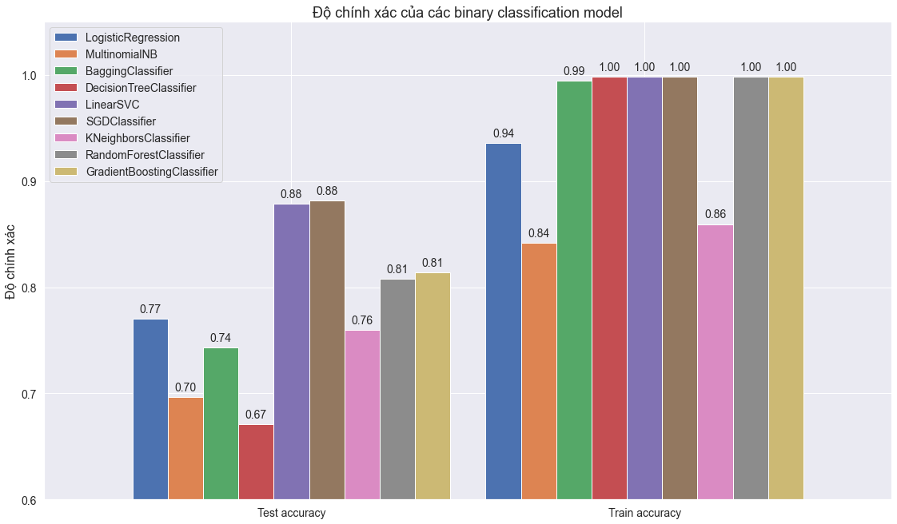
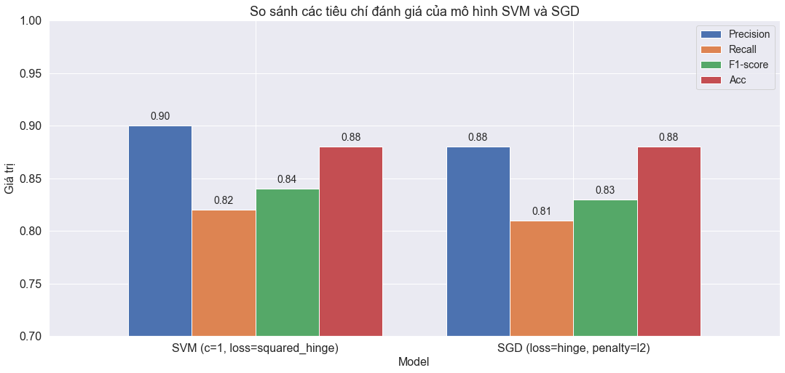

 <h1 align="center">Vietnamese News Genre Classifier📰</h1>

## Table of Contents
- [Introduction](#introduction)
- [Dataset](#dataset)
- [Categories](#categories)
- [Methodology](#methodology)
  - [Trained Models](#trained-models)
  - [Training Process](#training-process)
- [Results](#results)
- [Web Application](#web-application)
- [Requirements](#requirements)

## Introduction

This project leverages machine learning to predict article genres from vnexpress.net, a leading Vietnamese news portal. The methodology encompasses data extraction, preprocessing, feature engineering, and model optimization across 9 algorithms. Hyperparameter tuning is employed to identify the most suitable model. The culmination is a web application that visualizes predictions, demonstrating practical application of NLP techniques in content categorization.

## Dataset

The dataset consists of articles spanning various fields and is divided into 6 attributes:
- Title
- Abstract
- Content
- Author
- Date
- Label

**Location**: `./data/vnexpress_data.csv`

## Categories

| News & Current Affairs | Business & Technology | Lifestyle & Entertainment | Education & Thought |
|------------------------|----------------------|---------------------------|---------------------|
| World                  | Business             | Travel                    | Education           |
| Current Affairs        | Real Estate          | Health                    | Science             |
| Law                    | Digitalization       | Sports                    | Perspective         |
|                        | Vehicles             | Entertainment             |                     |

## Methodology

### Trained Models

Nine machine learning models were utilized, chosen for their suitability to the problem:

1. LogisticRegression
2. MultinomialNB
3. BaggingClassifier
4. DecisionTreeClassifier
5. LinearSVC
6. SGDClassifier
7. KNeighborsClassifier
8. RandomForestClassifier
9. GradientBoostingClassifier

### Training Process

- Data split: 80% training, 20% testing
- Feature extraction: TFIDF

## Results

### Initial Model Performance

### Optimized Model Performance

After hyperparameter optimization, the two standout models showed the following results:

## Web Application

A Flask-based web application was developed to visualize the predictions.

**Try it out:**
- Run `flask_app.py` locally
- Visit [lethanhhiep.pythonanywhere.com](https://lethanhhiep.pythonanywhere.com)

## Requirements

- Python 3.10
- scikit-learn
- pandas
- underthesea
- Flask 3.0
